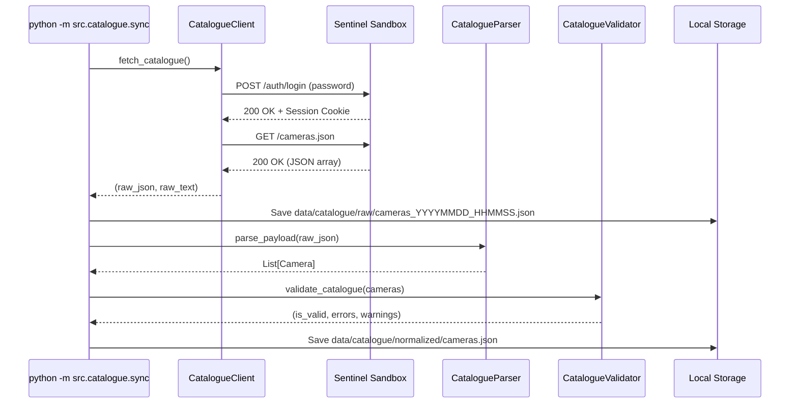

# Sentinel Catalogue API Specification

## 1. Overview
The Sentinel Camera Grid exposes a catalogue of surveillance feeds across Gujarat.

- **Endpoint**: `https://cctv.corp8.cloud/cameras.json`
- **Login Portal**: `https://cctv.corp8.cloud/auth/login`
- **Integrator Guide**: `https://cctv.corp8.cloud/resource`
- **Authentication**: Form password (`password: <PASSWORD>`), Session Cookie (`session`), or Bearer token.

---

## 2. Raw Response Format

The live sandbox returns an array of camera objects:

```json
[
  {
    "id": "cam01",
    "name": "01 Chiman bhai Bridge"
  },
  {
    "id": "cam02",
    "name": "02 Janpath"
  }
]
```

---

## 3. Normalized Internal Schema (`Camera`)

Stored under `data/catalogue/normalized/cameras.json`:

| Field | Type | Description |
| :--- | :--- | :--- |
| `camera_id` | `string` | Unique identifier (e.g. `"cam01"`) |
| `name` | `string` or `null` | Display name / landmark title |
| `location` | `string` or `null` | Physical location string |
| `latitude` | `float` or `null` | Geographic latitude (never invented) |
| `longitude` | `float` or `null` | Geographic longitude (never invented) |
| `status` | `string` | Status (`"active"`, `"inactive"`, `"maintenance"`, `"unknown"`) |
| `codec` | `string` | Video codec (`"H264"`, `"H265"`, `"UNKNOWN"`) |
| `width` | `int` or `null` | Video frame width in pixels |
| `height` | `int` or `null` | Video frame height in pixels |
| `fps` | `float` or `null` | Catalogue reported FPS (strictly informational) |
| `bitrate` | `int` or `null` | Video bitrate |
| `rtsp_url` | `string` or `null` | RTSP ingest URL (`rtsp://...`) |
| `hls_url` | `string` or `null` | HLS streaming URL (`https://...`) |
| `webrtc_url` | `string` or `null` | WebRTC / WHEP URL |
| `timezone` | `string` or `null` | Local timezone (e.g. `"Asia/Kolkata"`) |
| `extra` | `object` | Preserved dictionary of all unrecognized attributes |

---

## 4. Synchronization Lifecycle (`src.catalogue.sync`)


